# team_7012
這是 **Team_7012** 參與「基於區域微氣候資料預測發電量」競賽所提交的專案，提供了主辦單位要求的預測模型及其重現結果的程式碼。以下是具體說明：

---
## 注意事項
- 為了方便各位使用者重現，repository中已放入幾個處理好的CSV檔案，因此會下載較久，建議下載整個repository的ZIP檔案
- 在比賽期間訓練時有些模型未設置隨機種子，
可能導致重新訓練與原比賽結果略有差異。
如需精確驗證結果，建議使用下載檔案連結的比賽權重檔案。
- 驗證結果請參考[程式碼使用說明](#程式碼使用說明)
- 所有檔案皆在，[Googledrive](https://drive.google.com/drive/folders/1zxUio2HN6ZE6C5R6WliX3PjrSg4B-v6V?usp=sharing)
  若有遺漏資訊可以透過信箱聯絡作者lala9456@gmail.com


---
## 資料分析-視覺化網站
提供一個簡單的互動式視覺化網站，用於展示數據分析及模型預測結果，幫助使用者直觀理解模型表現。
網址
[視覺化網站](https://app.powerbi.com/view?r=eyJrIjoiZTRjM2M0NWUtY2RlOS00ZDI3LThkZWUtNDY3MjUyNzVkNmRlIiwidCI6IjlmMzAyYTkwLTc3NjEtNDRkNi05MjgyLTdjY2M0NWYzOGY3YSIsImMiOjEwfQ%3D%3D)
- 第1頁
  
  各裝置發電量時間序列圖，可供使用者自行選擇各裝置跟不同時間段的發電數據
  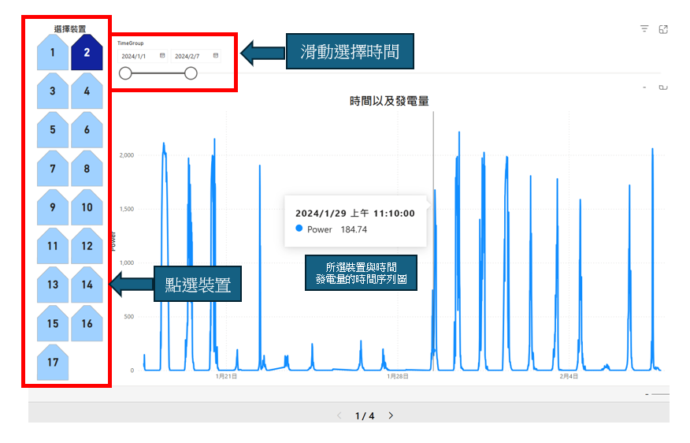
- 第2頁
  
  各裝置發電量以及濕度、溫度、氣壓、光照（主辦所提供之資料）的散佈圖與迴歸直線、相關係數，可供使用者自行選擇各裝置跟不同時間段的資訊查看
  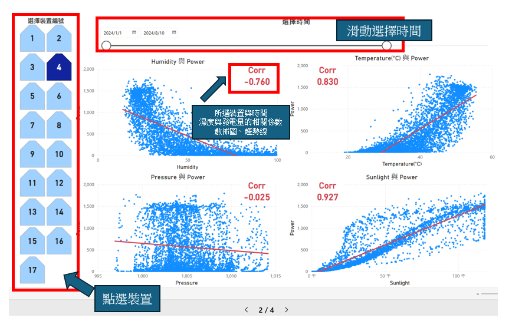
- 第3頁
  
  選擇兩個裝置，查看彼此濕度、溫度、氣壓、光照、發電量的散佈圖與迴歸直線、相關係數，其中圖表的-1代表所選的第一個裝置，-2代表所選的第二個裝置
  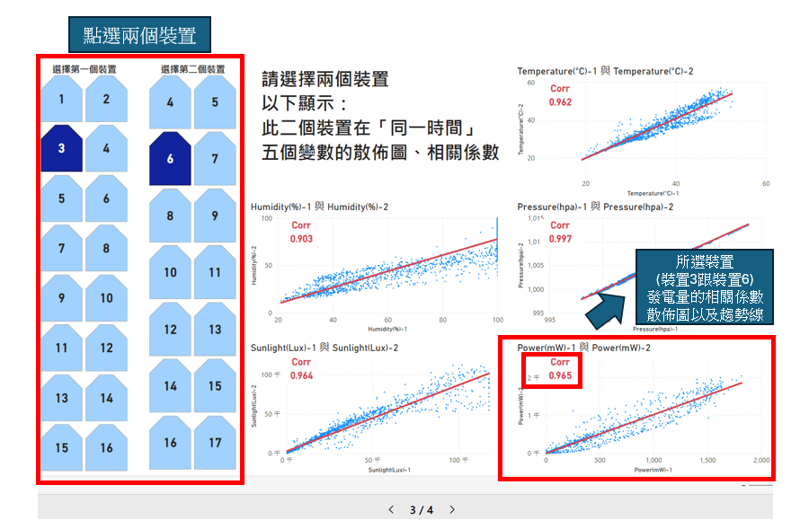
- 第4頁
  
  各裝置發電量以及濕度、溫度、日射量（花蓮市氣象局的外部資料）、太陽仰角的散佈圖與迴歸直線、相關係數，可供使用者自行選擇各裝置跟不同時間段的資訊查看
  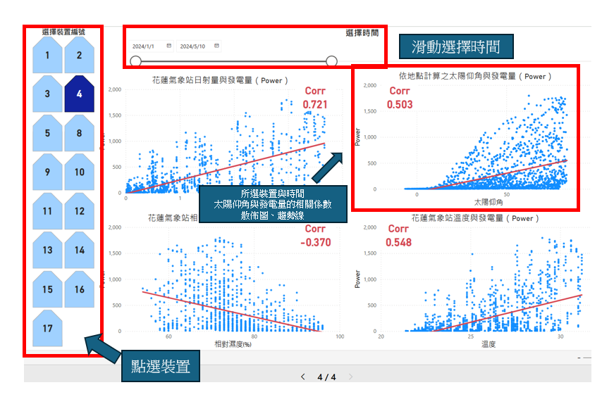

---

## 模型訓練簡介
- 本隊伍模型皆使用Random Forest，並分別採用三種策略訓練並綜合其中兩個策略的優勢來做預測
1. **同地異時法**

    利用前日相同時間點的氣象資訊（如光照、濕度、溫度等原始資料）對應今日的發電量建模，資料可用主辦提供之資訊以及第三方天氣資訊進行訓練
    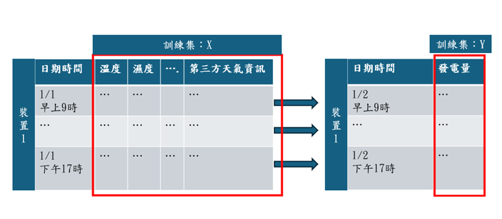
2. **異地同時法**
   
    不同裝置彼此間在每項天氣數值都擁有非常強烈的相關性（相關係數大多超過0.95），因此考慮相同時間點不同裝置的氣象資料（光照、溫度、濕度）與發電量，利用其他裝置的資料建模
      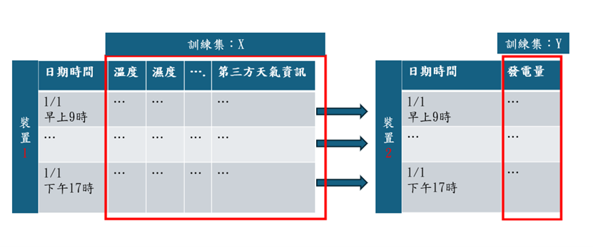
3. **同地同時法**
      
    使用中央氣象局公開的天氣資料，並結合自製的特徵（如太陽仰角、理論日射量）建模，此方法的訓練及預測資料皆為第三方資料
    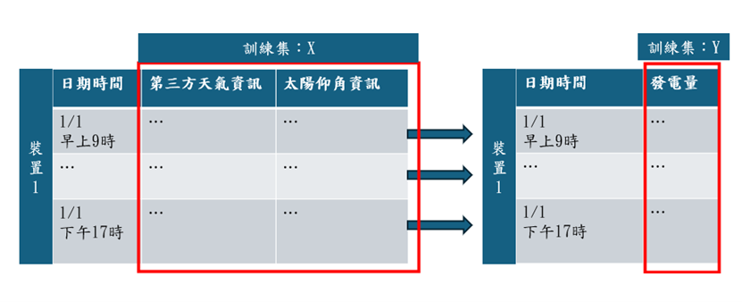
### 三種策略模型評估
以5折交叉驗證(5-fold cross validation)的Mean Absolute Error(以下簡稱MAE)來做評估
| 方式       | 訓練資料                     | MAE  | 限制                                             |
|------------|------------------------------|------|--------------------------------------------------|
| 同地異時   | 主辦提供或第三方資料          | 最大 | 天氣不穩定時預測較不準確                        |
| 異地同時   | 主辦提供（必備）與第三方資料（加入後效果佳） | 最小 | 需要兩個裝置皆有觀測資料才能進行訓練或預測      |
| 同地同時   | 只有第三方資料                | 中間 | 難以掌握各裝置間小地區的天氣差異                |

- **各方法評估結果**
  
  同地異時模型MAE普遍較大，而異地同時模型的最小MAE遠低於另外兩者，但異地同時受限於會遇到該裝置在某些時段無資料的情況
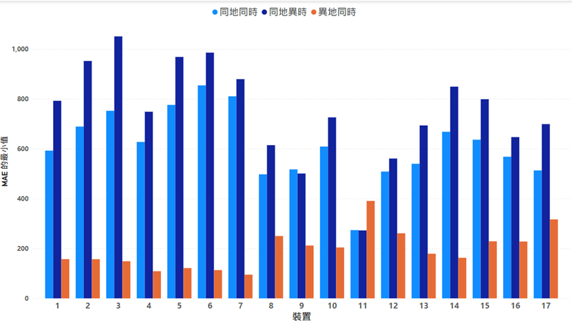
## 預測方式
- 最高分預測結果：Private Leaderboard 421362.8 (Rank7)
- 預測流程
1. 先採取異地同時法，17個裝置都分別以另外16的裝置之時間有交集的資料做訓練，共計訓練17×16=272個模型，並記錄每個模型5折交叉驗證的MAE。
2. 採取同地同時法訓練17個裝置的模型。
3. 預測某裝置該時段發電量時，優先使用異地同時法MAE最小的模型對應到的裝置，若該裝置該時段無資料則依序使用MAE較大的模型，若其他16個裝置皆無異地同時之資料則使用同地同時之模型預測。
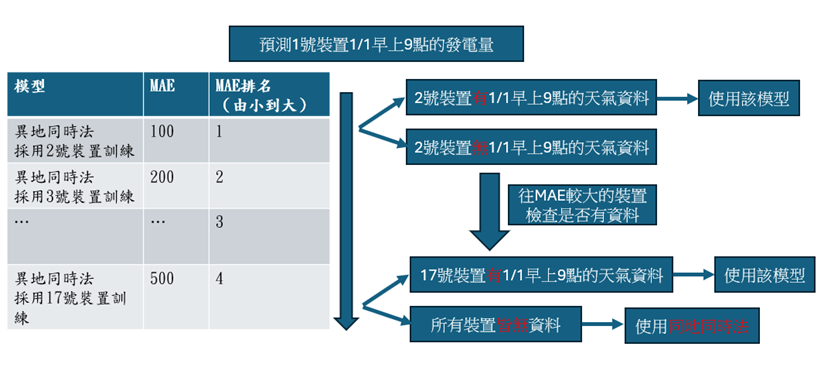


## 程式碼使用說明
### 1. 環境設置
- 本隊伍使用 **Python 3.12** 以及anaconda作為開發環境。
- 安裝所需套件，請使用以下命令安裝套件：
  ```bash
  conda create --name yourenvname python==3.12
  conda activate yourenvname
  pip install -r requirements.txt
### 2. 資料前處理
- 資料前處理程式碼已提供，
- 結果檔案只有weather_sun_combine.csv需另外下載，其他皆已放在repository中
### 3. 模型訓練與權重檔案
- 由於模型訓練的權重檔案較大，提供下載連結：[Googledrive](https://drive.google.com/drive/folders/10Oxgz7N0iUbgS9COQwB1CwuHbsRITImN?usp=sharing)
  1. 下載所有權種檔案夾裡面的所有內容
  2. 將檔案解壓縮，放到 ./模型訓練程式碼/model_each_location相應名稱的資料夾中
  3. 因為權重檔案較大，下載較久，請務必確認所有權重皆下載完成並且放入正確之路徑
   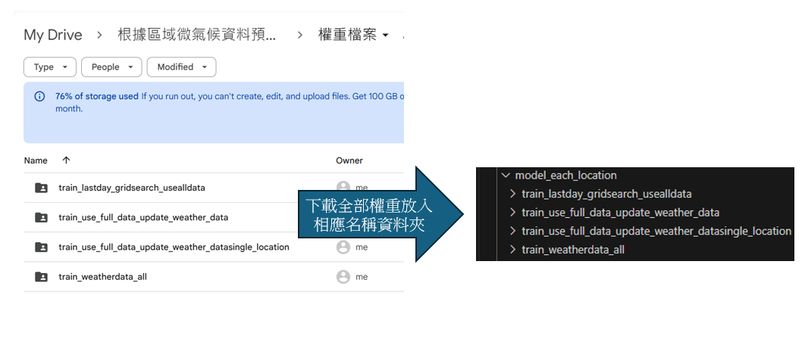
- 有關前處理檔案較大的數據，在執行之前請先下載，提供下載連結：[Googledrive](https://drive.google.com/drive/folders/1er89_figAMLEFkaXcKVBW1qLy1tR4ukK?usp=drive_link)
  1. 下載weather_sun_combine.csv（第三方天氣資料經前處理後的總表），將其放入 ./資料前處理以及第三方資料。
   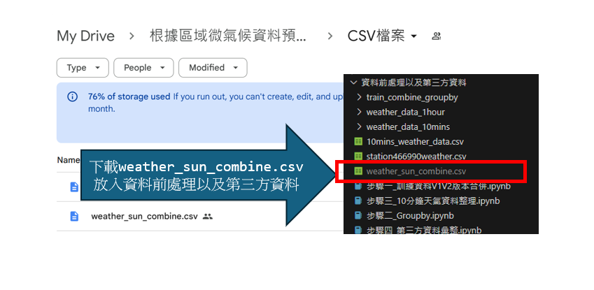

### 4. 模型重現與預測
- 提供分數最高的幾個模型，供使用者進行重現訓練或預測。
- 總共有3種模型訓練模式，分別是同地異時、異地同時、同地同時（有兩種版本，分別是使用每間隔10分鐘的天氣資料以及使用全部第三方已集自行計算之變數之模式）
- 若需驗證競賽結果，可直接下載權重檔案放入相應路徑(見3.之說明以及程式碼註解)，並執行predict_private_hightest.ipynb

